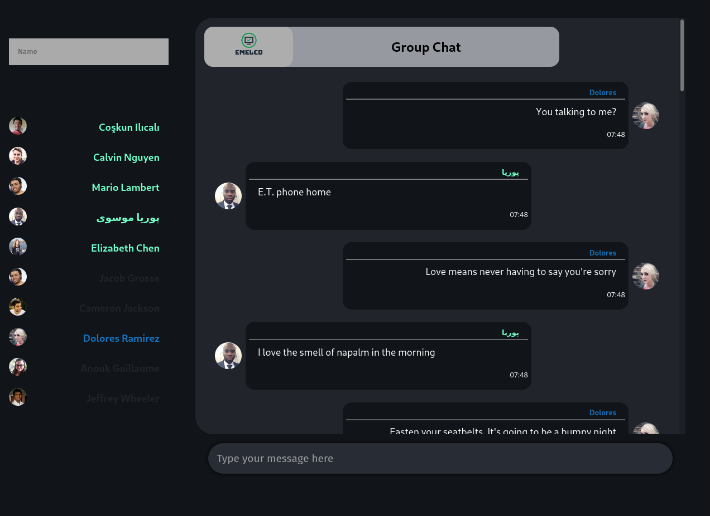

# Chatting MERN powered 🗯️

## About 📚

A full-stack Chat Application in MERN stack.

## Preview 🔍

## Installation 🔧

### Install Dependencies 📦 FrontEnd

    cd frontend
    npm install || yarn install
    npm start || yarn start

### Install Dependencies 📦 BackEnd

    cd frontend
    npm install || yarn install
    node server.js || nodemon server.js

## Builded With 🧰

1. MongoDB - NoSQL database
2. Express - RESTful API
3. React JS - useContext() hook over the CART
4. NodeJS - Server

- ReactJs / SASS / ReactHooks
- mongoose / uuid / body-parser

## Features 🔎

1. Real Time Chat
2. User Auth
3. Connect to MongoDB
4. Multiple Chat Rooms
